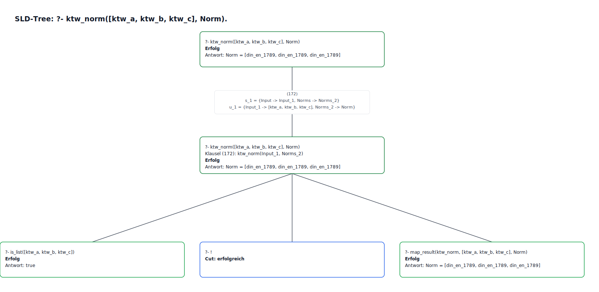

# Prolog Python API (SWI-Prolog + PySwip)

This project provides a reusable Python interface for querying a SWI-Prolog knowledge base from Python code.

The core idea is to treat a `.pl` file as a declarative knowledge base and expose selected Prolog queries through a Python service layer. This makes the interface suitable for different projects where logical rules, facts, and relationships should be maintained separately from the Python application code.



---

## Features

- Use SWI-Prolog as a logical knowledge base
- Query Prolog facts and rules from Python
- Clear separation between:
  - Prolog knowledge base
  - Python engine wrapper
  - Python service/API layer
  - external Python client code
- Generic request/response structure
- Suitable for reuse across multiple projects
- Supports both predefined service methods and raw Prolog queries

---

## Project Structure

```text
prolog_api_project/
├─ knowledge/
│  └─ context.pl          # Prolog knowledge base
├─ prolog_api/
│  ├─ engine.py           # Low-level PySwip / SWI-Prolog wrapper
│  ├─ service.py          # Application-facing service/API layer
│  └─ __init__.py
├─ client_example.py      # Example client using the API
├─ requirements.txt
└─ README.md
```

---

## Dependencies

### Python

- Python 3.10 or newer
- PySwip

Install Python dependencies with:

```bash
pip install -r requirements.txt
```

Example `requirements.txt`:

```txt
pyswip>=0.3.0
```

### Prolog

This project requires a local SWI-Prolog installation.

#### Windows installation via winget

```powershell
winget install --id SWI-Prolog.SWI-Prolog -e
```

Verify the installation:

```powershell
swipl --version
```

If `swipl` is not recognized but SWI-Prolog was installed successfully, the SWI-Prolog binary directory is probably missing from the `Path` environment variable.

The default installation path is usually:

```text
C:\Program Files\swipl\bin
```

You can test it directly with:

```powershell
& "C:\Program Files\swipl\bin\swipl.exe" --version
```

If this works, add the following folder to your Windows `Path` environment variable:

```text
C:\Program Files\swipl\bin
```

After changing the environment variable, close the current terminal and open a new PowerShell window.

#### macOS

Install SWI-Prolog with Homebrew:

```bash
brew install swi-prolog
```

Verify:

```bash
swipl --version
```

#### Linux

On Debian or Ubuntu-based systems:

```bash
sudo apt update
sudo apt install swi-prolog
```

Verify:

```bash
swipl --version
```

---

## Setup

### 1. Clone the repository

```bash
git clone <repo-url>
cd prolog_api_project
```

### 2. Create a virtual environment

Linux / macOS:

```bash
python -m venv venv
source venv/bin/activate
```

Windows PowerShell:

```powershell
python -m venv venv
.\venv\Scripts\Activate.ps1
```

Windows CMD:

```cmd
python -m venv venv
venv\Scripts\activate.bat
```

### 3. Install Python dependencies

```bash
pip install -r requirements.txt
```

### 4. Verify SWI-Prolog

```bash
swipl --version
```

If a version number is printed, SWI-Prolog is available from the terminal and PySwip should be able to access it.

---

## Knowledge Base Example

Define your Prolog facts and rules in `knowledge/context.pl`.

Example:

```prolog
person(alice).
person(bob).
person(charlie).

role(alice, developer).
role(bob, designer).
role(charlie, manager).

skill(alice, python).
skill(alice, prolog).
skill(bob, figma).
skill(charlie, planning).

project(alpha).
project(beta).

works_on(alice, alpha).
works_on(bob, alpha).
works_on(charlie, beta).

has_skill(Person, Skill) :-
    skill(Person, Skill).

suitable_for_project(Person, Project) :-
    person(Person),
    works_on(Person, Project).
```

---

## Usage

### Initialize the API

```python
from prolog_api import PrologService

api = PrologService("knowledge/context.pl")
```

The `PrologService` loads the Prolog file and makes its facts and rules available to Python.

---

### Query through the service API

```python
response = api.handle_request({
    "action": "people_with_skill",
    "params": {
        "skill": "python"
    }
})

print(response)
```

Example response:

```python
{
    "ok": True,
    "action": "people_with_skill",
    "data": ["alice"]
}
```

---

### Query project members

```python
response = api.handle_request({
    "action": "project_members",
    "params": {
        "project": "alpha"
    }
})

print(response)
```

Example response:

```python
{
    "ok": True,
    "action": "project_members",
    "data": ["alice", "bob"]
}
```

---

### Check a logical condition

```python
response = api.handle_request({
    "action": "suitable_for_project",
    "params": {
        "person": "alice",
        "project": "alpha"
    }
})

print(response)
```

Example response:

```python
{
    "ok": True,
    "action": "suitable_for_project",
    "data": True
}
```

---

### Execute a raw Prolog query

```python
response = api.handle_request({
    "action": "raw_query",
    "params": {
        "query": "role(Person, Role)"
    }
})

print(response)
```

Example response (long):

```python
{
    "ok": True,
    "action": "raw_query",
    "data": [
        {"Person": "alice", "Role": "developer"},
        {"Person": "bob", "Role": "designer"},
        {"Person": "charlie", "Role": "manager"}
    ]
}
```

For a shorter response, add `"mode": "short"`:

```python
response = api.handle_request({
    "action": "raw_query",
    "params": {
        "query": "role(Person, Role)",
        "mode": "short"
    }
})
```

If the query is boolean, the short result becomes `True` or `False`. If the query returns a single variable, the short result returns a scalar or list of values.

`explain_query` also supports `"mode": "short"` for a compact answer-only response instead of the full SLD tree.

---

## Running the Example

After installing the dependencies and verifying SWI-Prolog, run the example client from the project root:

```bash
python client_example.py
```

On Windows, if the virtual environment is active:

```powershell
python .\client_example.py
```

The example file initializes the API, loads `knowledge/context.pl`, sends several requests to the service layer, and prints the returned Python dictionaries.

Expected output will look similar to:

```python
{'ok': True, 'action': 'people_with_skill', 'data': ['alice']}
{'ok': True, 'action': 'project_members', 'data': ['alice', 'bob']}
{'ok': True, 'action': 'suitable_for_project', 'data': True}
{'ok': True, 'action': 'raw_query', 'data': [{'Person': 'alice', 'Role': 'developer'}, {'Person': 'bob', 'Role': 'designer'}, {'Person': 'charlie', 'Role': 'manager'}]}
```

The exact output depends on the facts and rules defined in your Prolog file.

---

## API Concept

The service layer uses a generic request/response format.

### Request

```python
{
    "action": "string",
    "params": {
        "key": "value"
    }
}
```

### Successful Response

```python
{
    "ok": True,
    "action": "string",
    "data": ...
}
```

### Error Response

```python
{
    "ok": False,
    "error": "Description of the error"
}
```

---

## Extending the API

### 1. Add a new Prolog fact or rule

Example in `knowledge/context.pl`:

```prolog
can_execute(alice, task1).

can_execute_task(Person, Task) :-
    can_execute(Person, Task).
```

---

### 2. Add a service method

In `prolog_api/service.py`:

```python
def can_execute_task(self, person: str, task: str) -> bool:
    query = f"can_execute_task({person}, {task})"
    return self.engine.is_true(query)
```

---

### 3. Register the action in `handle_request`

In `prolog_api/service.py`:

```python
elif action == "can_execute_task":
    data = self.can_execute_task(
        params["person"],
        params["task"]
    )
```

The client can then call:

```python
response = api.handle_request({
    "action": "can_execute_task",
    "params": {
        "person": "alice",
        "task": "task1"
    }
})
```

---

## Recommended Design Principles

- Keep Prolog files declarative.
- Keep Python client files simple.
- Place application-specific query logic in `service.py`.
- Avoid spreading raw Prolog queries across the application.
- Validate external input before building Prolog query strings.
- Prefer typed service methods over unrestricted raw queries in production.
- Use raw queries mainly for development, debugging, or internal tooling.

---

## Notes on Query Safety

The simple examples in this project build Prolog queries with Python f-strings. This is convenient for prototypes, but input should be validated before being inserted into a Prolog query.

For production systems, consider:

- validating symbols against an allowlist
- escaping or rejecting unsafe characters
- avoiding unrestricted `raw_query` access for external users
- exposing only predefined service actions

---

## Possible Extensions

This structure can be extended with:

- FastAPI REST interface
- Docker setup for Python and SWI-Prolog
- Multiple Prolog knowledge bases
- Project-specific service classes
- CLI interface
- Test suite with pytest
- SWI-Prolog MQI-based architecture for larger systems
